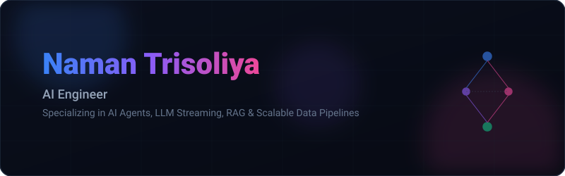

  

  
  
  
  

---

### 💫 About Me

Hi, I'm **Naman Trisoliya** 👋 
I am an **AI Engineer** passionate about building intelligent systems and scalable data infrastructures. I graduated from the **Indian Institute of Technology (IIT) Bhilai** with a B.Tech in **Data Science & Artificial Intelligence** (GPA: **8.87 / 10**).

My technical interests and areas of focus include:
* 🤖 **Generative AI & Agentic Systems**: Designing multi-agent orchestration, real-time LLM streaming interfaces, and human-in-the-loop (RLHF) feedback systems.
* 📊 **Scalable Data Engineering**: Building high-throughput ingestion pipelines and low-latency data streaming workflows using Spark, Kafka, and Pulsar.
* ⚡ **Model Optimization & Edge AI**: Exploring model compression techniques (like knowledge distillation), multimodal Computer Vision & NLP, and resource-constrained on-device inference.
* 🛠️ **Full-Stack AI Integration**: Bridging AI/gRPC backend services with streaming frontends to create seamless, responsive user experiences.

---

### 🛠️ Tech Stack & Skills

| Domain | Technologies |
| :--- | :--- |
| **AI & Machine Learning** |        `Deep Learning` `Transformers` `LangGraph` `MCP (Model Context Protocol)` `Agentic Workflows` `RAG` `Prompt Engineering` |
| **NLP & Vision** |  `BERT` `Knowledge Distillation` `Computer Vision` |
| **Backend & Data** |      |
| **Languages** |     |
| **DevOps & Cloud** |     |
| **Frontend** |   `LLM Streaming UI` |
